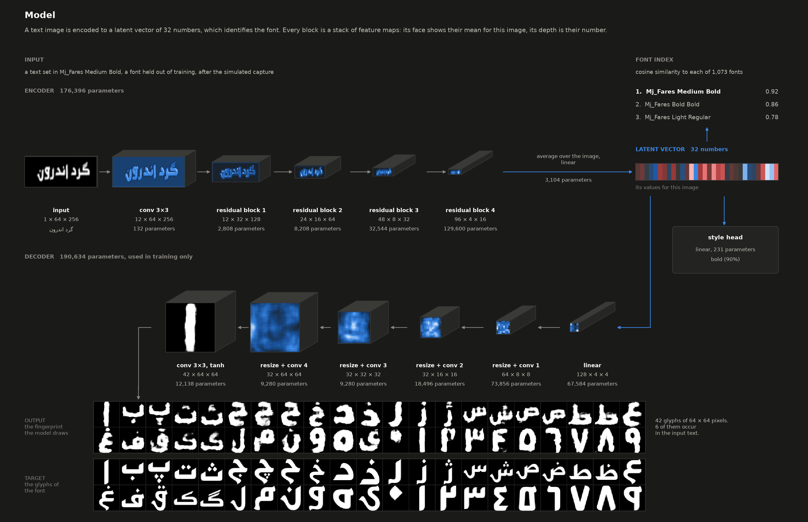
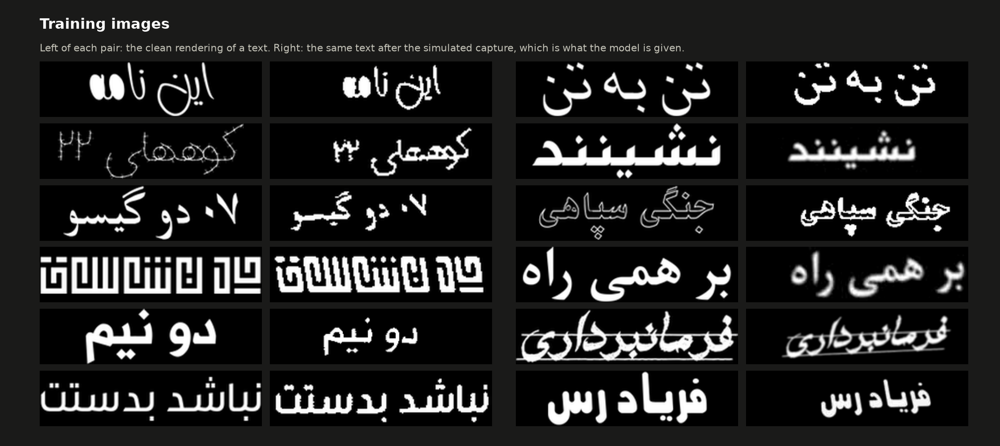
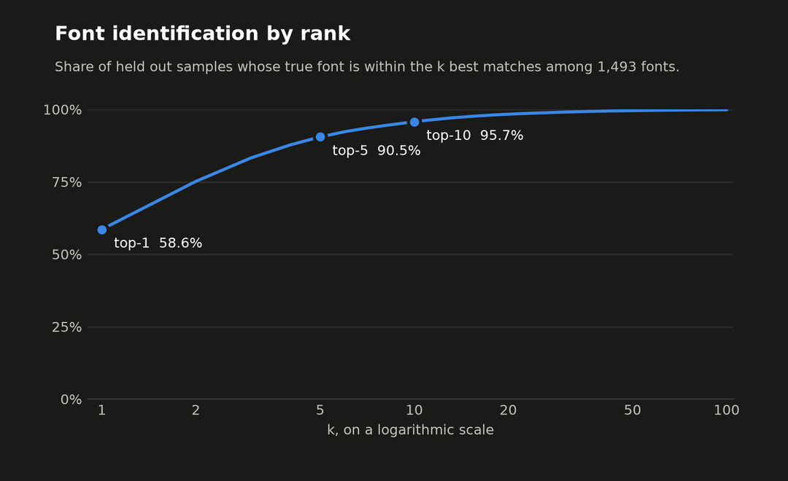
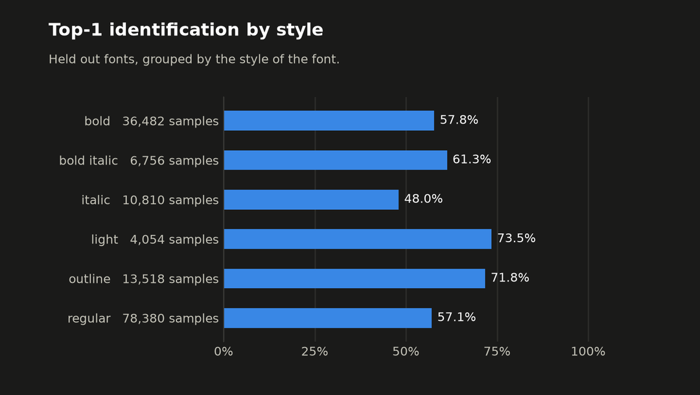
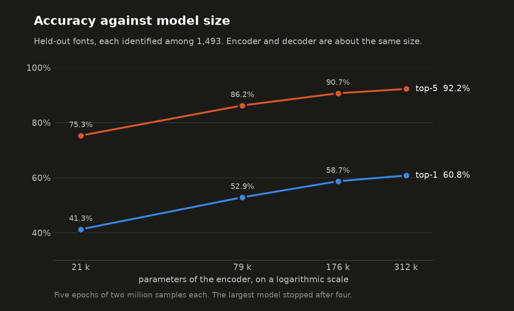
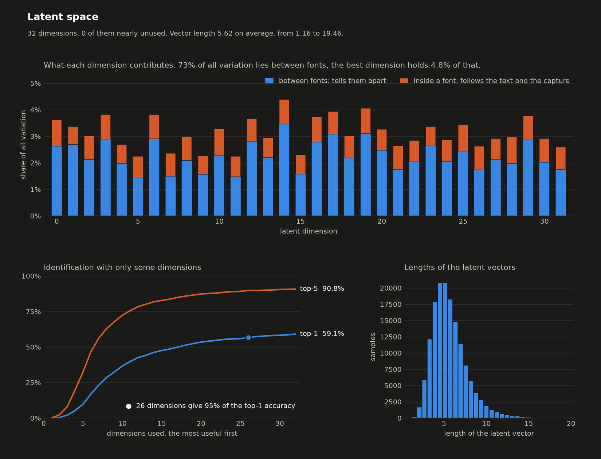
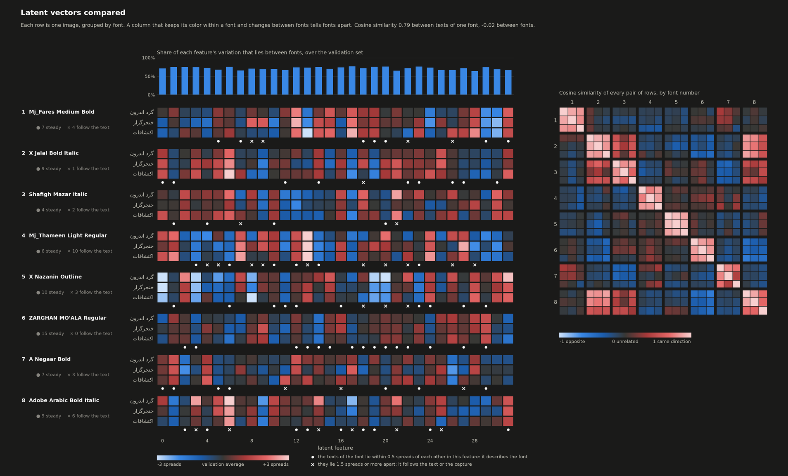
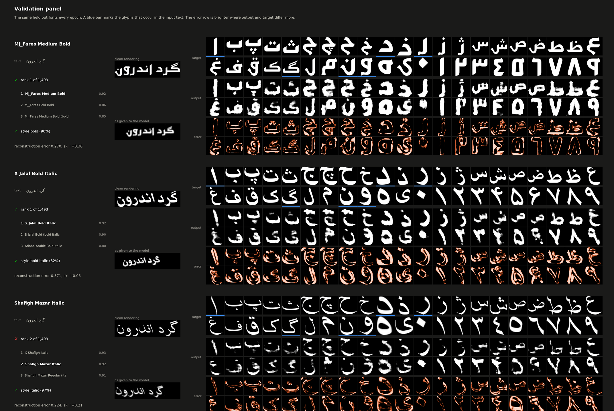
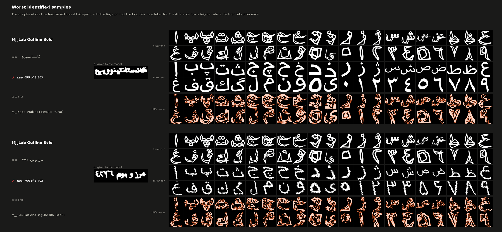
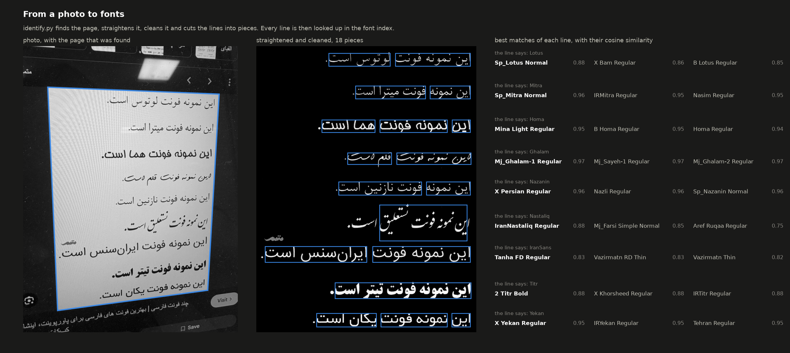

# Font Reconstructor

**Identifying Persian fonts, including ones never seen in training, from a photo of a few words.**

A small convolutional encoder turns an image of a short Persian text into a vector of 32 numbers that
describes the font. A font is identified by comparing that vector with the stored vectors of known fonts. A
new font is added by rendering a hundred sample texts with it; the model is not retrained. A decoder that
redraws all 42 glyphs of the font from the same vector, its *fingerprint*, is trained alongside and is what
gives the project its name.



| | |
|---|---|
| Fonts | 1,073 Persian fonts of 756 families, plus 420 synthetic variants |
| Held out for evaluation | 111 fonts of whole families, never trained on |
| Top-1 / top-5 accuracy on held-out fonts, one image of 6 to 16 characters | **58.6% / 90.5%** among 1,493 fonts |
| The same with 3 / 5 / 10 images of the font | 80.6% / 85.9% / 91.2% top-1 |
| Encoder | 176 thousand parameters, 0.7 MB, 1.1 ms per image on one CPU core |
| Training | one pass over 10 million generated images, 2 hours on a laptop GPU |

## Contents

1. [Method](#1-method)
2. [Results](#2-results)
3. [Identifying fonts in your own images](#3-identifying-fonts-in-your-own-images)
4. [Reproducing the training](#4-reproducing-the-training)
5. [Limitations](#5-limitations)
6. [Related work](#6-related-work)
7. [Licences](#7-licences)

## 1. Method

### 1.1 Task

Font recognition is usually posed as classification over a fixed list of fonts. That cannot name a font it
was not trained on, and font collections change all the time. Here the model learns an embedding instead.
Fonts are told apart by the distance of their embeddings, so the list of known fonts is data, not weights.
The evaluation follows from that: whole font families are held out of training, and the model is scored on
how often it finds these unseen fonts among all fonts.

### 1.2 Data

All training images are generated, so no labelled photos are needed.

- **Fonts.** 1,073 Persian fonts in 7 styles: 604 regular, 252 bold, 82 italic, 53 light, 40 outline,
  30 bold italic, 10 shadow. Outlined and slanted fonts are rare, so 420 more are made by drawing regular
  fonts outlined or slanted ([synthetic fonts](#synthetic-fonts)). They are trained on, never evaluated on.
- **Texts.** Runs of 6 to 16 characters from the Shahnameh and from the most frequent words of the Persian
  Wikipedia, as in Persis [2]. One text in ten gets a number added.
- **Capture simulation.** A real query image was printed or shown on a screen, photographed and cleaned
  up. Every training image goes through a simulation of that: slight rotation and perspective, ink spread,
  blur, uneven light, sensor noise, low resolution, JPEG compression, then background removal, contrast
  stretch and, for half of the images, a threshold. A result that no longer shows its text is discarded.
- **Target.** The fingerprint of the font: its 32 letters and 10 digits, each drawn alone at 64 by 64 pixels.



Every image is fixed by its index and a seed, and rendered when it is read. The training set therefore has
no size on disk and can be as large as the run: the final model saw 10 million texts once each.

### 1.3 Model

The figure at the top shows the model with a real validation sample. Its numbers are those of the released
model.

| part | layers | output | parameters |
|------|--------|--------|-----------:|
| encoder | 3×3 convolution, then four residual blocks that each halve the image | 96 × 4 × 16 | 173,292 |
| | average over the image, linear layer | 32 | 3,104 |
| decoder (training only) | linear layer, four resize-and-convolve blocks, 3×3 convolution, tanh | 42 × 64 × 64 | 190,634 |
| style head (training only) | linear layer on the latent vector | 7 | 231 |

The encoder averages over the image before its last layer, so the latent vector does not depend on where
a stroke lies or on how wide the image is. The decoder upsamples by resizing followed by a convolution,
which avoids the checkerboard patterns of transposed convolutions [6].

### 1.4 Objective

Three terms are minimised together:

| term | weight | purpose |
|------|-------:|---------|
| reconstruction: mean absolute error of the fingerprint and of its averages over blocks of 2, 4 and 8 pixels | 1 | the latent vector has to describe the glyphs, also those the text does not show |
| supervised contrastive loss [4] on the latent vector, temperature 0.1 | 0.5 | images of one font lie together and apart from other fonts, by cosine similarity |
| cross-entropy of the style head | 0.2 | the style can be read from the latent vector by a linear layer |

The reconstruction loss is taken at several scales because a plain pixel loss punishes a thin stroke drawn
one pixel off twice, once where it is missing and once where it is. With it the model learned to leave
outline fonts blank. Batches hold 128 fonts with 4 images each, so every image has three partners of its
font and 508 images of other fonts to be pushed from.

### 1.5 Identification

For every known font, 100 sample images are encoded and their vectors stored. The centre of a font is the
mean of its vectors. A query is given to the font whose centre has the highest cosine similarity to the
query's vector. Several images of the same font are scaled to unit length and averaged first.

## 2. Results

All numbers are for the released model on the 111 held-out fonts: 150,000 validation images, put through
the capture simulation, each identified among 1,493 fonts (chance is 0.07%).

### 2.1 Identification

| | top-1 | top-5 | mean reciprocal rank |
|---|---:|---:|---:|
| one image | 58.6% | 90.5% | 0.722 |

The true font is almost always among the first few candidates. What is left is the choice between fonts
that look alike, such as the same typeface from two foundries.



A single short text shows only a few of a font's glyphs. Averaging the vectors of several texts of the
same font helps more than anything else that was tried:

| images of the font | 1 | 3 | 5 | 10 |
|---|---:|---:|---:|---:|
| top-1 | 58.6% | 80.6% | 85.9% | 91.2% |

By style, italic fonts are the hardest. Outline fonts, which were the worst before synthetic variants and the
multi-scale loss, are now among the best. The light style has only three held-out fonts.



### 2.2 Model size

Encoder and decoder were grown together, five epochs of two million images each.

| encoder channels | decoder width | encoder parameters | decoder parameters | top-1 | top-5 | training loss | held-out loss |
|---:|---:|---:|---:|---:|---:|---:|---:|
| 4 | 4 | 20,580 | 26,954 | 41.3% | 75.3% | 0.284 | 0.291 |
| 8 | 9 | 79,368 | 80,034 | 52.9% | 86.3% | 0.257 | 0.277 |
| **12** | **16** | **176,396** | **190,634** | **58.7%** | **90.7%** | 0.235 | 0.270 |
| 16 | 22 | 311,664 | 319,130 | 60.8% | 92.3% | 0.223 | 0.269 |

The largest run stopped after four of its five epochs. Accuracy flattens: every step up gains about half
of what the step before it did. The reconstruction loss on held-out fonts stops improving while the
training loss keeps falling, so the larger decoders fit the training fonts, they do not draw unseen fonts
better. The third size was released.



### 2.3 What the latent vector holds

73% of the variation of the latent vectors lies between fonts, the rest follows the text and the capture.
All 32 dimensions are in use, and 24 of them give 95% of the accuracy. A model with 64 dimensions put its
information into about 32 directions as well: 32 of them held 99.4% of its accuracy. Rounding the stored
vectors to 8 bits changes nothing (58.5%), so a vector takes 32 bytes; at 4 bits accuracy falls to 54.0%.



The next figure puts the vectors of eight held-out fonts side by side, three texts of each. A column that
keeps its colour within a font and changes between fonts tells fonts apart. Dots mark the features that
stay the same over the texts of a font, crosses those that follow the text.



### 2.4 Reconstruction

The decoder draws the right characters in about the right weight, slant and proportions, also for glyphs
the input text does not show: their error is the same as that of the glyphs it does show (0.291 and 0.292).
The strokes are soft and details are missing. The model removes 19% of the error of a font-blind guess, the
median fingerprint of the training fonts. It does not know the details of an unseen font from one short text,
and a blurred stroke is the best answer to a pixel loss under that uncertainty.



The worst identified images of the validation set, next to the font they were taken for:



### 2.5 What did not help

| change | result |
|--------|--------|
| latent vector of 64 instead of 32 numbers | 32 directions still held 99.4% of the accuracy |
| decoder four times as large | lower training loss, the same loss on held-out fonts |
| one pass over 10 million images instead of five over 2 million | 58.6% against 58.7% top-1 |
| batches of 512 instead of 256 images | ahead by 0.4 points after one million images, no difference in the full run |
| batches of 128 or 1,024 images | 1.5 and 1.7 points behind after one million images |
| peak learning rate between 0.008 and 0.032 | within 0.1 points of each other |
| a decoder that draws one glyph at a time, trained on the glyphs of the text only | the glyphs of the text came out no better, twice the training time |
| 16 bit floats on Apple's GPU | 7 to 9% faster at best, and a different loss |

The comparisons were single runs, so differences of a few tenths of a point are not results.

### 2.6 Cost

| | |
|---|---|
| encoder | 176,396 parameters, 38 million multiply-adds per image, 693 KB of weights |
| one image on one CPU core | 1.1 ms |
| batches of 256 on the GPU | 17,000 images per second |
| training step, 512 images | 0.35 s |
| training | 19,530 steps in 2 hours 7 minutes |

Measured on an Apple M5 Pro with PyTorch's MPS backend.

## 3. Identifying fonts in your own images

The repository ships the trained model and an index of the 1,073 fonts it was trained and evaluated with:

```text
pretrained/
  font_encoder.pth        the model: weights, architecture and how its training images were rendered, 1.5 MB
  fonts.sqlite            the font index: 100 latent vectors and the names of each font, 9 MB
  training_config.json    the configuration of the training run
```

```bash
python identify.py query photo.jpg
```

```text
18 pieces of text in 9 lines, compared with 1,073 fonts
...
line by line, the best matches of each
  1. Sp_Lotus Normal (0.88),  X Bam Regular (0.86),  B Lotus Regular (0.85)
  2. Sp_Mitra Normal (0.96),  IRMitra Regular (0.95),  Nasim Regular (0.95)
  ...
```



The photo above shows a page of nine lines, each set in the font it names, photographed from a screen at an
angle. The font family named in the line is the first match for six lines and among the first three for
eight. The ninth, IranSans, is not in the index. Lotus is one of the families held out of training.

### 3.1 What happens to an image

`font_reconstructor/preprocessing.py` brings an image to what the model was trained on, in five steps:

1. **Page.** The largest evenly coloured, roughly rectangular area is taken for the page, which leaves out
   the desk around a sheet or the rest of a screen. Its edges are then located in the image itself.
2. **Straightening.** A page seen at an angle is mapped back to a rectangle by its four corners, which also
   makes its lines parallel again. Tilt that is left is measured from the rows of the image and turned out.
3. **Cleanup.** The paper level is read from the brightest spots of every neighbourhood and removed, and the
   contrast is stretched, so that text is white on black whatever its colours were and under uneven light.
4. **Segmentation.** Lines are found from the rows that hold strokes, and every line is cut at the gaps
   between its words into pieces about as wide as the training texts.
5. **Framing.** Each piece is cropped to its text and fitted into the 256 by 64 input.

The pieces are encoded, and the result is given for all text together and for every line on its own, since
an image can show several fonts. A best similarity below 0.8 is reported as no close font.

### 3.2 The font index

The index is a small vector database in one SQLite file (`font_reconstructor/index.py`). For every font it
keeps the latent vectors of its sample images, as 16 bit floats, with the name, family, style and origin of
the font. The search is exact: with a few thousand fonts it is one matrix product. The file records which
model its vectors come from and refuses to be used with another.

```bash
python identify.py list --filter nazanin        # the fonts of the index
python identify.py add MyFont.ttf               # add a font, also one the model never saw
python identify.py add MyFont.ttf --name "My Font" --samples 200 --replace
python identify.py remove "My Font"
python identify.py build -c pretrained/training_config.json    # rebuild it from a font collection
```

`add` renders 100 sample texts with the font, puts them through the capture simulation, encodes them and
stores the vectors. It needs the text corpus under `data/corpus` and [text shaping](#text-shaping). `query`
needs neither. All commands take `--model`, `--index` and `--device`; `query` also takes `-k`, `--per-line`,
`--json` and `--debug-dir`, which writes the pieces of text that were found.

To use a model you trained yourself, export it and build its index:

```bash
python scripts/export_model.py -r saved/models/<name>/<run>/model_best.pth -o pretrained/font_encoder.pth
python identify.py --index pretrained/fonts.sqlite build -c saved/models/<name>/<run>/config.json
```

From Python:

```python
from font_reconstructor.inference import FontIdentifier

identifier = FontIdentifier('pretrained/font_encoder.pth', 'pretrained/fonts.sqlite')
result = identifier.identify('photo.jpg', k=5)
for match in result.matches:
    print(match['rank'], match['name'], round(match['similarity'], 2))
```

## 4. Reproducing the training

### 4.1 Setup

The project uses a plain virtual environment. Python 3.9 or newer is required.

```bash
python3 -m venv .venv
source .venv/bin/activate
pip install --upgrade pip
pip install -e ".[dev]"
```

`pip` installs the PyTorch build that matches the machine: the MPS-enabled build on Apple silicon
and the default CUDA build on Linux. For a specific CUDA version, install `torch` and `torchvision`
from the matching index first, see <https://pytorch.org/get-started/locally/>.

#### Text shaping

Persian and Arabic letters change shape and join inside a word, and are written right to left. Pillow
only does this with its Raqm layout engine, which needs the FriBiDi library at runtime:

```bash
brew install fribidi            # macOS
sudo apt install libfribidi0    # Debian, Ubuntu

python -c "from PIL import features; print(features.check('raqm'))"    # has to print True
```

On Apple silicon Homebrew installs to `/opt/homebrew/lib`, which is not on the default library search
path. If the check still prints `False`, run with `DYLD_FALLBACK_LIBRARY_PATH=/opt/homebrew/lib`.

`config.json` sets `"layout_engine": "raqm"`, so training stops with an explanation if shaping is not
available. Without shaping every letter would be drawn in its isolated form, in reversed order.

### 4.2 Data

Fonts, an annotation file and the text corpus are expected under `data/`:

```text
data/
  fonts/            TrueType or OpenType font files
  fonts.csv         one row per font
  corpus/           text files to render, see below
  cache/            rendered images and fingerprints, created on first use
```

The repository contains the annotation file, the corpus and the 49 fonts that are under a free licence, see
[data/fonts/README.md](data/fonts/README.md). The other 1,024 fonts of the collection are listed in
`data/fonts_manifest.csv` with their checksums, but not distributed. Fonts whose files are missing are skipped
with a message, so a clone trains on the 49 fonts as it is, and on more once you add font files of your own.

`fonts.csv` has these columns:

| column | meaning |
|--------|---------|
| `font` | display name of the font, used as its label |
| `file` | path of the font file, relative to `data/fonts` |
| `supported_charset` | the characters of the font. Texts only use these characters, and each one except the space gets a channel of the fingerprint. |
| `family` | optional. Groups the weights and styles of one typeface. Without it the family name stored in the font file is used. |
| `style` | optional. The style of the font, which the style head of the model learns to predict. Any set of labels works, for example calligraphic styles such as naskh or kufi. Without it the style is derived from the names of the font: `outline` or `shadow` for decorated fonts, otherwise `light`, `regular` or `bold`, followed by `italic` for slanted ones. |

Every font should list its characters in the same order. A null character (`\0`) keeps the slot of
a character that a font does not support empty, so that glyph positions stay aligned between fonts.
Fonts that fail to open, or that miss a glyph of their charset, are skipped with a message.

The number of fingerprint channels is the longest charset in the file. The model reads it from the
data, so it does not have to be configured.

#### Duplicate fonts

Font collections often contain the same typeface under several names. To the model these are different
classes that look the same, which hurts training and makes top-1 accuracy unreachable for them.

```bash
python scripts/dedupe_fonts.py            # dry run: prints the duplicates and writes a report
python scripts/dedupe_fonts.py --apply    # moves duplicates to data/fonts_duplicates/ and rewrites the csv files
```

The script renders every glyph of every font, compares all pairs of fonts, and calls two fonts
duplicates if they agree on every glyph (`--threshold` for the average difference, `--glyph-threshold`
for the worst glyph). Weights and styles of a typeface are kept. The dry run writes
`data/dedupe_report/` with the list of duplicates and a picture of sample pairs for judging the
thresholds. `--apply` keeps backups of the csv files. Changing the font list invalidates the caches
and the font numbering of earlier runs, so apply it before a training run, not during one.

#### Synthetic fonts

Collections have many regular fonts and few outlined or slanted ones. `synthetic_variants` in the `dataset`
block fills those styles up: it takes a number of extra fonts per style, and each is a real font drawn
outlined, slanted or heavier. A variant is a font of its own, with its own text images, fingerprint and
style label.

```json
"synthetic_variants": {"outline": 200, "italic": 120, "bold italic": 100}
```

| style | drawn as | made from |
|-------|----------|-----------|
| `outline` | hollow, with a line around the glyphs | regular, bold and light fonts |
| `italic` | slanted, top leaning left as Persian slanted styles do | regular fonts |
| `bold italic` | slanted | bold fonts |
| `bold` | with a heavier stroke | regular fonts |

Variants are in the family of their font, so the variants of a held out font are not trained on.
Validation uses real fonts only. All fonts, real and synthetic, are among those a font is identified from.

#### Text corpus

Texts are drawn from the files listed under `corpus_files`. Each line of a file is a phrase, or a
single word. A text is a run of consecutive words of one line that fits `text_length`. Words with
characters outside a font's charset are skipped. Without `corpus_files`, random characters of the
charset are rendered.

```bash
python scripts/download_corpus.py
```

This downloads the two sources of the default config, which are also in the repository. The choice follows the Persis font recognition
paper [2], which renders the Shahnameh and dictionary words. Persis does not
publish its text files, so public equivalents are used:

| file | content | source |
|------|---------|--------|
| `data/corpus/shahnameh.txt` | the Shahnameh of Ferdowsi, one half-verse per line | [Persian poems corpus](https://github.com/amnghd/Persian_poems_corpus), public domain text |
| `data/corpus/words.txt` | the 50,000 most frequent words of the Persian Wikipedia | [Persian Words Frequency](https://github.com/behnam/persian-words-frequency), CC BY-SA 3.0 |

Any other utf-8 text file works as well. Arabic letter forms and digits are converted to their Persian
forms, and diacritics are removed.

#### Images like real ones

A text image that reaches the model in practice was printed or shown on a screen, photographed, and
then cleaned up to a tight crop of white text on black. Training images go through a simulation of
that history (`CaptureSimulation` in `font_reconstructor/dataset/capture.py`):

1. slight rotation and perspective that deskewing did not remove
2. ink spread or loss, lens blur and camera motion
3. a dark-on-light photo with uneven lighting, sensor noise, limited resolution and JPEG compression
4. the cleanup: background removal, contrast stretch, and for half of the images a threshold. The paper
   level is fitted as a plane, so the inside of heavy strokes stays ink.
5. a crop to the text with a random margin and resizing to the model input. The crop never cuts into the
   text by default, because the dots and tails of letters at the edge tell fonts apart.

Every result is compared with the clean text it was made from. If the text was lost, broken up or drowned
in noise, the simulation runs again, and after four such results the clean rendering is used instead. An
image like that tells little about the font, and nobody would use it to identify one. `min_agreement` sets
how much damage is accepted: it is the lowest correlation with the clean text, 0.9 by default.

The simulation also avoids damage that a real capture does not do. The photo is exposed for its brightest
paper, so paper is never blown out and taken for ink, and strokes are only thickened or thinned by a pixel
where that does not wipe out hairlines or close up outlined letters.

Steps 2 and 4 make strokes thicker or thinner, which is what a real threshold does. Texts are rendered
at `render_scale` times the model input, so these changes are finer than one pixel of the input.

| setting | where | meaning |
|---------|-------|---------|
| `render_scale` | `dataset` | size of the cached renderings relative to the model input, 2 by default. `font_size` should be about `render_scale` times the input height. |
| `number_ratio` | `dataset` | share of the texts that get a number of one to four digits added |
| `capture` | `dataset` | arguments of `CaptureSimulation`, for example `{"binarize_prob": 1.0}` if your preprocessing always binarizes |
| `random_augmentations` | `data_loader` | run the training images through the simulation |
| `validation_augmentations` | `data_loader` | run the validation images through it as well. Every image gets the same distortion each time. |
| `random_augmentations` | `clustering_data_loader` | run the reference images of each font through it too |

Set the `capture` options to match your own preprocessing. The closer the simulated cleanup is to the
real one, the better the model carries over to real images. A set of real, labelled crops is the only
way to measure that.

### 4.3 Training

```bash
python train.py -c config.json
python train.py -c config.json --lr 0.0005              # override single settings
python train.py -r saved/models/<name>/<run>/checkpoint-epoch10.pth    # resume
```

`config.json` is the configuration of the released model: one pass over 10 million images in 5 parts of
2 million, batches of 128 fonts with 4 images each, Adam with a one-cycle learning rate that peaks at 0.016.

Checkpoints go to `saved/models/<name>/<run>/` and logs to `saved/log/<name>/<run>/`. Follow a
run with `tensorboard --logdir saved/log`.

The first run renders all text images and font fingerprints into `data/cache/`. Later runs with
the same settings map these files into memory, so they start fast and data loader workers share
one copy.

#### Training sets of any size

Every sample is determined by its index and the `random_seed`, so a text does not have to be kept in a
file to be the same each time. With `"cache_images": false` in the arguments of `data_loader`, the
training texts are rendered when they are read. That gives exactly the images the cache would hold, takes
no disk space and no time before the run, and makes the size of the training set free. Since the data is
generated, it can be as large as the whole run, so that no text is trained on twice:

```json
"data_loader": {"args": {
    "total_samples": 10000000,
    "epoch_samples": 2000000,
    "validation_samples": 150000,
    "cache_images": false,
    ...
}}
```

| setting | meaning |
|---------|---------|
| `total_samples` | size of the training set. With `validation_samples` all of it is for training. |
| `epoch_samples` | samples of an epoch. Every epoch draws from its own part of the training set, so with `epochs` times `epoch_samples` equal to `total_samples` the run is one pass over the data, with a validation and a checkpoint after every part. A resumed run goes on with the part it stopped at. Needs `batch_fonts`. |
| `validation_samples` | size of the validation set. Its texts then do not depend on the size of the training set. Without it the validation set takes its share of `total_samples`. |
| `cache_images` | false to render the training texts when they are read |
| `cache_validation_images` | false to do the same for the validation texts. They are read in every epoch, so they are kept in a file by default. The `clustering_data_loader` has its own `cache_images`. |

Rendering when reading costs memory instead of disk space: each data loader worker opens the fonts
itself, about a gigabyte per worker for a thousand fonts. It is fast, though. Six workers render and
distort 3,000 images a second here, so `num_workers` can be lower than with a cache.

The progress bar of a run counts the steps of all epochs together. It shows the time that is left of the
run and the loss that is optimized, averaged over the last hundred steps.

#### Learning rate

The `lr_scheduler` block takes any class of `torch.optim.lr_scheduler`. Its `interval` says when the
scheduler is stepped: after every `"epoch"`, or after every `"batch"`. An epoch has thousands of batches,
so schedules with a warmup need `"batch"`.

The default is `OneCycleLR`: the rate rises from `max_lr / div_factor` to `max_lr` during the first
`pct_start` of all steps, then falls along a cosine to almost zero. The length of the schedule is the
`epochs` of the trainer, so `epochs` is a budget here: lower it to finish sooner, and expect the run to
use all of it unless early stopping ends it. The `lr` of the optimizer and the `--lr` option have no
effect with this scheduler, `max_lr` sets the rate. The position in the schedule is stored in
checkpoints, so a resumed run continues where it stopped.

To find `max_lr` for a config, run a range test. It trains for a few hundred steps while the rate rises
and writes a plot of the loss against the rate:

```bash
python scripts/find_lr.py -c config.json
```

Pick the rate where the loss stops falling, a few times below the rate where it starts to rise. Run the
test again after changing the batch size or the loss weights, they move the usable rates.

#### What is trained and how it is measured

- **Held out fonts.** `validation_split` holds out whole font families. Validation and `test.py`
  only use those fonts. Each of them is identified among all fonts, the training fonts included.
- **Loss.** The reconstruction loss (`loss`) plus `contrastive_loss.weight` times a supervised
  contrastive loss on the latent vector. The default reconstruction loss is `multiscale_l1_loss`: the
  mean absolute error of the fingerprint and of its averages over blocks of 2, 4 and 8 pixels. With a
  plain pixel loss (`l1_loss`), a thin stroke drawn one pixel off costs twice as much as drawing
  nothing, which taught the model to leave outline fonts blank. `val_recon_skill` is always measured
  with the plain pixel error, so it stays comparable between losses.
- **Glyphs of the text only, optional.** With a `reconstruction` block of `{"glyphs": "text", "glyphs_per_sample": 8}` the
  reconstruction is trained on glyphs that occur in the text of each image instead of the whole fingerprint:
  eight of them per image, picked at random, some twice if the text shows fewer. The model is then not asked to
  guess glyphs it has not seen. It also makes the conditioned decoder affordable, which only draws those
  glyphs. Validation still draws the whole fingerprint, so `val_loss` stays comparable between runs, and
  `val_seen_glyph_loss` and `val_unseen_glyph_loss` show how the glyphs it was not trained to draw come out.
  The training `loss` covers the picked glyphs only. It does not work together with the adversarial term.
  Set `glyphs` to `"all"` to train on the whole fingerprint again. Both settings can also be given on the
  command line, which overrides the config: `python train.py -c config.json --glyphs all`, and
  `--decoder joint` or `--decoder conditioned` for the kind of decoder.
- **Batches.** The contrastive loss needs several images of a font in one batch. Training batches
  hold `batch_fonts` fonts with `batch_samples_per_font` images each.
- **Style head.** With a `style_head` block, a single linear layer on the latent vector predicts the
  style of the font, trained with cross-entropy scaled by `weight`. It tells how much of the style can
  be read from the latent vector directly. With `"detach": true` it only measures that and does not
  shape the encoder. Training logs `style_loss` and `style_acc`. Validation logs `style_acc` and
  `style_balanced_acc`, the accuracy averaged over the styles. Most fonts are regular, so a model that
  always answers "regular" already gets a high `style_acc`, but only chance level on the balanced one.
- **Adversarial term, optional.** With an `adversarial_loss` block, a discriminator judges patches of
  the drawn fingerprints against real ones, and the decoder is also trained to pass as real. This
  follows MC-GAN [1] and sharpens strokes that a pixel loss leaves blurry.
- **Logged values.** `loss` is the reconstruction loss for training and validation. Training also
  logs the other terms and their weighted sum `total_loss`. Validation logs `top{k}_acc` and the
  values below.

#### What validation reports

Besides the losses and accuracies, every validation logs these scalars:

| scalar | meaning |
|--------|---------|
| `val_mrr` | mean reciprocal rank of the true font. 1 if it is always the best match. It reacts to every change in rank, not only to the top-k cut-offs. |
| `val_recon_skill` | share of the baseline's reconstruction error that the model removes. The baseline is the median fingerprint of the training fonts, the best answer without looking at the input. 0 is no better than that, 1 is perfect. |
| `val_seen_glyph_loss`, `val_unseen_glyph_loss` | reconstruction error of the glyphs that occur in the input text, and of those the model had to infer |

It also draws the figures below, every `figure_period` epochs. They go to tensorboard, and as image
files to the run's log directory, which is the easier place to look at them:

```text
saved/log/<name>/<run>/figures/
  latest/                 the newest version of every figure, the files to keep open
    samples.png
    worst_cases.png
    ...
  samples/                every epoch of one figure side by side
    epoch_001.png
    epoch_002.png
  worst_cases/
    ...
```

The files are written at `figure_dpi` dots per inch (200 by default), twice the resolution shown in
tensorboard, so they stay sharp when zoomed. Set `save_figures` to false to write none.


| tag | shows |
|-----|-------|
| `samples` | a fixed panel of held out fonts that cover the styles, the same every epoch: the clean rendering, the image given to the model, the rank of the true font with the three best matches, the predicted style, and target, output and error of every glyph. A blue bar marks the glyphs that occur in the input text. |
| `worst_cases` | the samples whose true font ranked lowest, next to the fingerprint of the font they were taken for. If the two look alike, the fonts are near-duplicates. |
| `glyph_error` | reconstruction error of each glyph, in the input text and not |
| `identification/by_rank` | share of samples whose true font is within the k best matches, for every k |
| `identification/by_style`, `identification/by_text_length` | top-1 accuracy by the style of the font and by the length of the text |
| `style_predictions` | which styles the style head answers for each true style |
| `latent_space` | what each latent dimension contributes: its share of all variation, split into the part between fonts, which tells them apart, and the part inside a font, which follows the text. Below it, the top-1 and top-5 accuracy with only the n most useful dimensions, which shows how many dimensions the model needs, and the lengths of the latent vectors. |
| `latent_comparison` | the latent vectors of the panel fonts side by side, three texts of each. Every latent feature is a column, coloured by how far it lies above or below the validation average. A column that keeps its colour within a font and changes between fonts tells fonts apart; one that changes within a font reacts to the text. Below the rows of each font, a dot marks the features whose values lie within half a spread of each other over its texts, which describe the font, and a cross marks those that lie one and a half spreads or more apart, which follow the text. The counts of both stand beside the font. Bars above give each feature's share of variation that lies between fonts, and a matrix beside it gives the cosine similarity of every pair of rows. |

The embedding projector gets the font, its family and its style as metadata, so the points can be
coloured by any of them.

### 4.4 Testing a checkpoint

```bash
python test.py -r saved/models/<name>/<run>/model_best.pth
```

The config next to the checkpoint is used. The script reports the loss, the configured metrics and
the top-k accuracies on the held out fonts, without augmentations.

### 4.5 Model options

The model is `CompactAutoEncoder`. Only its encoder is needed to identify a font. The decoder is a training
aid, so the two are sized separately:

| argument | part | effect |
|----------|------|--------|
| `base_channels`, `latent_dim` | encoder | size and speed of the model in use: 176 thousand parameters at the 12 and 32 of `config.json`, see [2.2](#22-model-size) |
| `decoder_channels`, `decoder_blocks` | decoder | training cost only. `decoder_blocks` is the number of convolution blocks at each resolution. |
| `decoder_type` | decoder | `"joint"` draws all glyphs at once, one output channel per glyph. `"conditioned"` draws one glyph at a time from the latent vector and a learned character embedding, sharing its weights between all glyphs. |

A training step with batches of 256 images, for an encoder of 16 channels:

| decoder | step | GPU memory |
|---------|-----:|-----------:|
| joint, width 8, all glyphs | 0.16 s | 4.3 GB |
| conditioned, width 8, 8 glyphs of the text of each image | 0.32 s | 6.8 GB |
| conditioned, width 16, 8 glyphs | 0.48 s | 10.3 GB |
| conditioned, width 8, all 42 glyphs | about 1.3 s | about 25 GB |

The last row is extrapolated from smaller batches. With a `style_head` block the model also gets a linear
layer on the latent vector that predicts the style of the font, and with an `adversarial_loss` block a
discriminator, `GlyphDiscriminator`. The adversarial term was only tried in a short run on an early, small
model, where it did not pay for its cost.

### 4.6 Devices

`n_gpu` and `device` in the config select where the model runs.

| `n_gpu` | `device` | result |
|---------|----------|--------|
| `0` | any | CPU |
| `1` or more | `"auto"` (default) | CUDA if available, else Apple's MPS backend, else CPU |
| `1` or more | `"cuda"`, `"mps"` or `"cpu"` | that backend, CPU if it is not available |

More than one GPU is only used with CUDA (`DataParallel`). The `-d` option limits the visible CUDA
devices. If an operation is not implemented for MPS in your PyTorch version, run with
`PYTORCH_ENABLE_MPS_FALLBACK=1` to let it fall back to the CPU.

### 4.7 Configuration

`config.json` is organised in these blocks:

| block | content |
|-------|---------|
| `arch` | model class and its arguments. Input size, output size and channels follow the dataset. |
| `dataset` | fonts, font size, layout engine, text corpus, text length and image sizes shared by all data loaders |
| `data_loader` | size, seed, held out share of fonts, augmentations and batch composition of the training data |
| `clustering_data_loader` | `samples_per_font` images per font, used to estimate the font centroids before each validation. Remove the block to skip top-k accuracy. |
| `optimizer`, `lr_scheduler` | any class of `torch.optim` and `torch.optim.lr_scheduler` |
| `loss`, `metrics` | names of functions in `font_reconstructor/model/loss.py` and `metric.py` |
| `reconstruction` | `glyphs`: train the reconstruction on `"all"` glyphs or on those of the `"text"`, and `glyphs_per_sample` |
| `contrastive_loss` | `weight` and `temperature` of the contrastive loss. Remove the block to train on reconstruction only. |
| `style_head` | `weight` of the style loss (0 turns the head off) and `detach` |
| `adversarial_loss` | `weight` of the adversarial term (0 turns it off), `start_epoch`, and `lr` and `discriminator_channels` of the discriminator |
| `trainer` | epochs, checkpointing (`save_period`, `keep_last_checkpoints`), monitoring, early stopping, `topk` values, tensorboard, `figure_period`, `save_figures`, `figure_dpi` |

Random augmentations only apply to the training data.

### 4.8 Project layout

```text
train.py, test.py           training and evaluation of a checkpoint
identify.py                 identify the font of an image, manage the font index
config.json                 configuration of the released model
pretrained/                 the released model and its font index
scripts/export_model.py     writes the model of a checkpoint to a file for identify.py
scripts/find_lr.py          learning rate range test
scripts/download_corpus.py  downloads the text corpus
scripts/dedupe_fonts.py     finds and removes fonts that draw the same glyphs
scripts/make_figures.py     draws the figures of this page that a training run does not write
font_reconstructor/
  preprocessing.py          from a photo to model inputs: page, straightening, cleanup, lines, pieces
  index.py                  FontIndex, the vector database of fonts
  inference.py              model export and FontIdentifier
  config.py                 ConfigParser: config file, command line overrides, run directories
  factory.py                builds fonts, corpus, loaders, model and losses from the config
  evaluation.py             font centroids and the evaluation loop shared by validation and test.py
  reporting.py              per-sample validation results, the extra scalars and the figure panel
  utils.py                  device selection, seeding, metric tracking
  dataset/                  fonts, corpus, rendering, capture simulation, caching, datasets, samplers, loaders
  model/                    CompactAutoEncoder, GlyphDiscriminator, losses, metrics
  trainer/                  BaseTrainer (epochs, checkpoints, monitoring) and Trainer
  logger/                   logging setup, tensorboard writer, the validation figures
tests/                      pytest suite, uses the fonts that ship with matplotlib
docs/figures/               the figures of this page
```

### 4.9 Development

```bash
pytest
flake8
```

## 5. Limitations

- **Evaluation is on simulated captures.** The accuracy above is measured on generated images. On real photos
  there is one worked example and no labelled test set, so no accuracy for real images is claimed.
- **One short text is not enough for a sure answer.** The first match is right 59% of the time, the right font
  is among five 90% of the time. Give several lines if you have them.
- **Close fonts are confused.** The collection holds the same typeface from several sources under different
  names. They count as different fonts here, which caps top-1 accuracy. `scripts/dedupe_fonts.py` finds them.
- **Italic fonts** are identified worst, 48% top-1.
- **The preprocessing expects text on a plain page.** A page photographed at an angle, on paper or a screen,
  works. A screenshot of an application with pictures, icons, several panels or dust on the screen does not:
  parts of the pictures are taken for text. Crop such an image to the text first.
- **Text in other scripts is not recognised as such.** A line of Latin text is compared with Persian fonts all
  the same. The similarity is low then, and the line is reported as having no close font.
- **Persian only.** The glyph set is the 32 Persian letters and the 10 Persian digits. Text is drawn in
  isolated letter forms in the fingerprint and in joined forms in the input.
- **Reconstructed fingerprints are soft.** They show the weight, slant and proportions of a font, not its details.

## 6. Related work

1. S. Azadi, M. Fisher, V. Kim, Z. Wang, E. Shechtman, T. Darrell. *Multi-Content GAN for Few-Shot Font Style
   Transfer.* CVPR 2018. Draws all glyphs of a font from a few of them, with one output channel per glyph. The
   joint decoder and the optional adversarial term follow it.
2. M. Mohammadian, N. Maleki, T. Olsson, F. Ahlgren. *Persis: A Persian Font Recognition Pipeline Using
   Convolutional Neural Networks.* 2023. Classifies Persian fonts from generated images. The choice of text
   corpus follows it.
3. Z. Wang, J. Yang, H. Jin, E. Shechtman, A. Agarwala, J. Brandt, T. Huang. *DeepFont: Identify Your Font from
   an Image.* ACM Multimedia 2015. Font recognition trained on synthetic text, with the gap to real images as
   its main problem.
4. P. Khosla, P. Teterwak, C. Wang, A. Sarna, Y. Tian, P. Isola, A. Maschinot, C. Liu, D. Krishnan. *Supervised
   Contrastive Learning.* NeurIPS 2020. The loss on the latent vector.
5. L. Smith. *Cyclical Learning Rates for Training Neural Networks.* WACV 2017. The learning rate range test.
6. A. Odena, V. Dumoulin, C. Olah. *Deconvolution and Checkerboard Artifacts.* Distill, 2016. Why the decoder
   resizes and convolves.

## 7. Licences

- **Code and the trained model:** MIT, see [LICENSE](LICENSE).
- **Fonts in `data/fonts`:** 47 under the SIL Open Font License 1.1 and 2 under the Bitstream Vera Fonts
  licence, each with its copyright notice in [data/fonts/README.md](data/fonts/README.md). The other fonts the
  model was trained with are not part of this repository. The font index holds vectors and names of all of
  them, no font data, and the figures show renderings of some of their glyphs.
- **Text corpus in `data/corpus`:** the Shahnameh is in the public domain. The word list comes from
  [Persian Words Frequency](https://github.com/behnam/persian-words-frequency) by Behnam Esfahbod, CC BY-SA 3.0.
